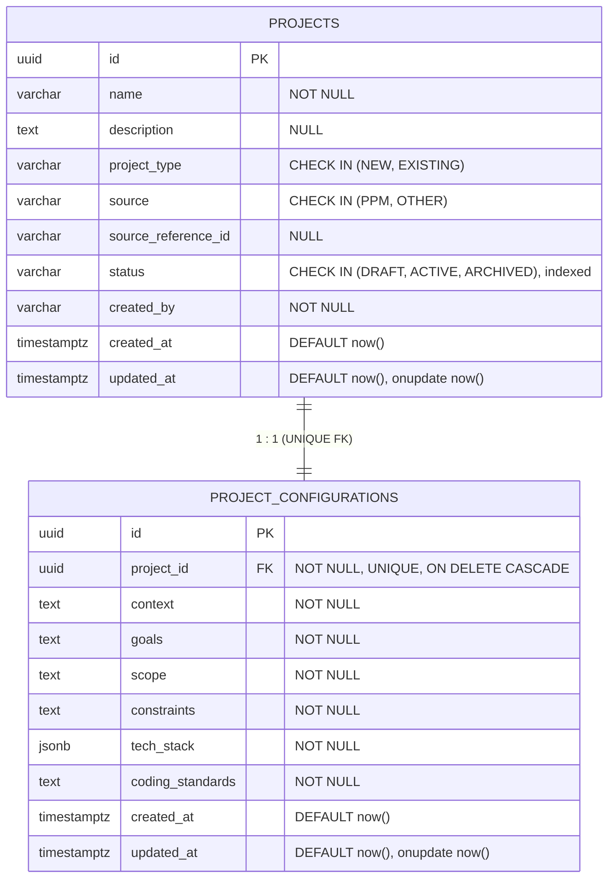
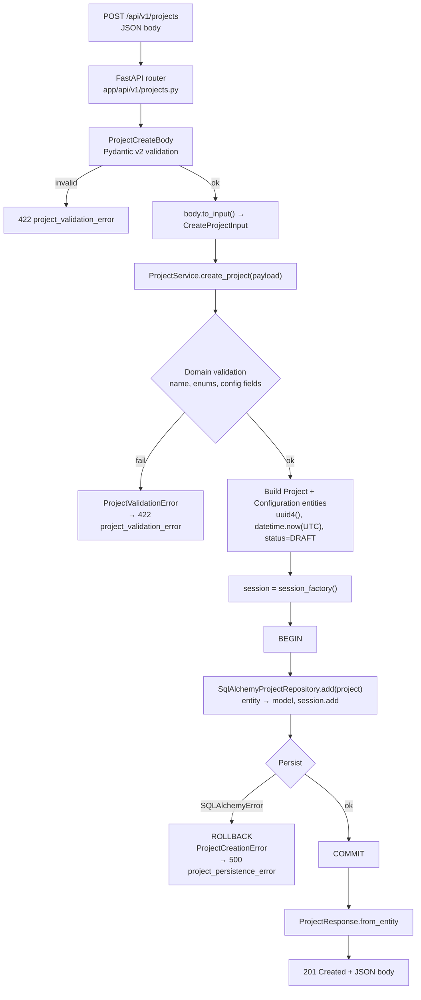
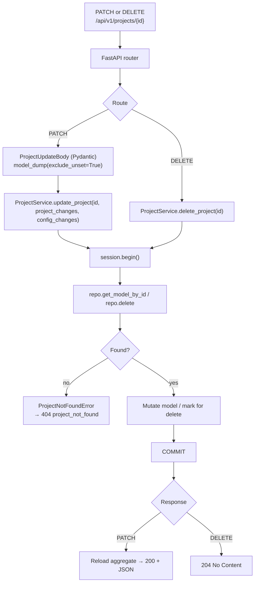

# Synapse — ERD and Request Flow

## Entity–Relationship Diagram



- `UNIQUE(project_id)` on `project_configurations` enforces the 1:1 at the DB level.
- Composite index on `projects(source, source_reference_id)` for lookups by originating system.
- Enum values live in `app/domain/enums/project.py` as `StrEnum`s — single source of truth for both CHECK constraints and service validation.

## API Request Flow (Create Project)



## API Request Flow (Update / Delete)



## Layering (framework-independent core)

```
HTTP client
    ↓
FastAPI router + Pydantic schemas    thin adapter
    ↓
ProjectService                        business rules + transactions
    ↓
AbstractProjectRepository             contract
    ↓
SqlAlchemyProjectRepository (impl)
    ↓
SQLAlchemy 2.x
    ↓
PostgreSQL 16
```
