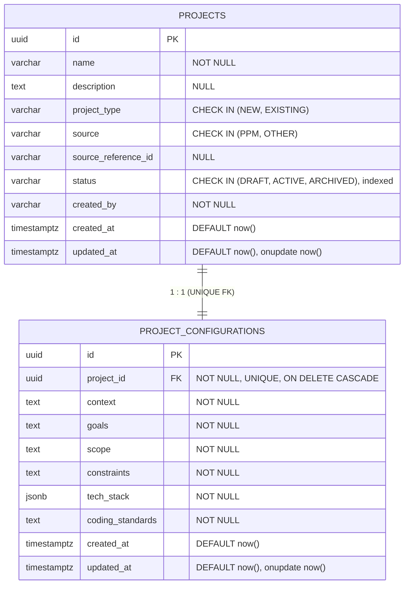
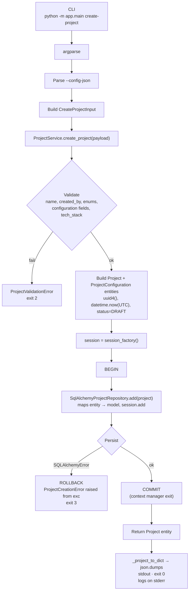

# Synapse — ERD and Project Creation Flow

## Entity–Relationship Diagram



Notes:
- `UNIQUE(project_id)` on `project_configurations` enforces the 1:1 at the DB level.
- Additional composite index on `projects(source, source_reference_id)` for lookups by originating system.
- Enum values live in `app/domain/enums/project.py` as `StrEnum`s and are the single source of truth for both CHECK constraints and service validation.

## Project Creation Flow



Layering (framework-independent):

```
CLI (app.main)
    ↓
ProjectService              business rules + transaction ownership
    ↓
AbstractProjectRepository   contract; SqlAlchemyProjectRepository implements
    ↓
SQLAlchemy 2.x
    ↓
PostgreSQL 16
```
